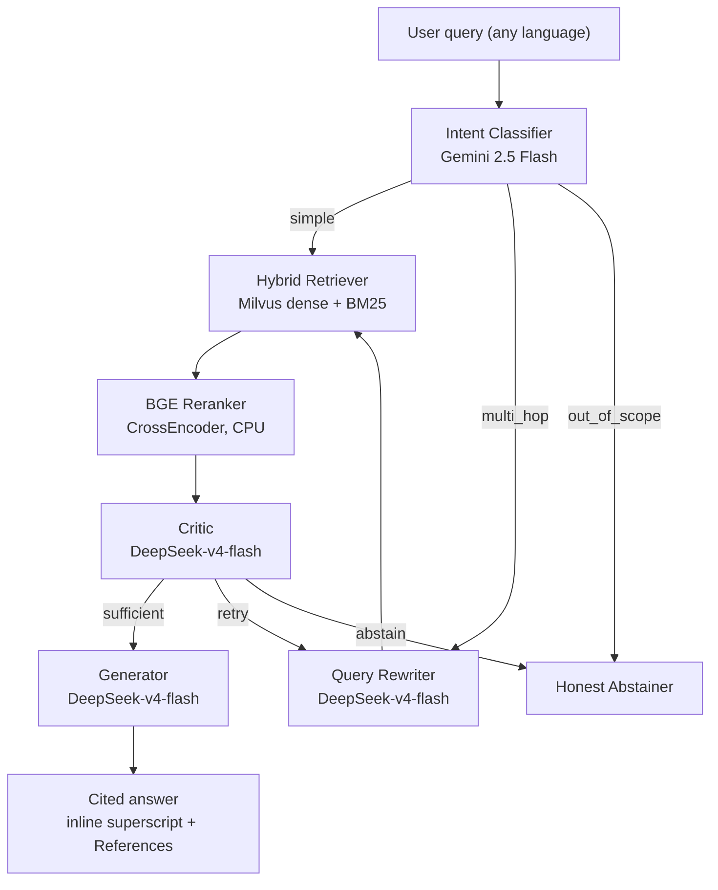

# 🧭 Meridian

> A cross-lingual, multimodal agentic RAG system — ask a question in Hindi, get an answer grounded in a Chinese source document (or an English one, or an audio recording, or a slide image), cited and verifiable.

---

## Architecture



**Tech Stack:** Milvus 2.6 (hybrid dense+BM25) · LangGraph (CRAG loop) · Gemini Embedding 001 (3072-dim) · DeepSeek v4 Flash (rewriter, critic, generator) · Gemini 2.5 Flash (intent) · BGE Reranker v2-m3 · Whisper-tiny · FastAPI · Streamlit · SQLite

**Coverage:** 3 languages (EN, HI, ZH) × 3 modalities (text, image, audio) × 4 business units (HR, IT Security, Product, Executive Comms) · 168 corpus chunks · 401 unit tests + 34 integration/E2E tests

---

## Quick Start

```bash
# 1. Clone
git clone https://github.com/inboxhsr/Meridian.git
cd Meridian

# 2. Configure environment
cp .env.example .env
# Edit .env with your API keys

# 3. Install dependencies
pip install -r requirements.txt streamlit>=1.38.0

# 4. Start Milvus
docker compose up milvus -d

# 5. Ingest the corpus
python scripts/run_ingest.py

# 6. Start the API server
uvicorn app.main:app --port 8000

# 7. Launch the UI (separate terminal)
streamlit run app/streamlit_app.py
```

**Or with Docker Compose (one command):**
```bash
docker compose up -d
# FastAPI on :8000, Streamlit on :8501
```

---

## API

| Endpoint | Method | Description |
|---|---|---|
| `/` | GET | Service info |
| `/health` | GET | Milvus status + corpus chunk count |
| `/query` | POST | Full agentic RAG pipeline |
| `/docs` | GET | Interactive Swagger UI |

**Example query:**
```bash
curl -X POST http://localhost:8000/query \
  -H "Content-Type: application/json" \
  -d '{"query": "What is the travel expense reimbursement limit?", "bu": "hr"}'
```

---

## Example Queries

| Query | Language | Expected Behavior |
|---|---|---|
| "What is the travel expense reimbursement limit?" | EN → EN | HR-scoped answer with dollar limits and flight class rules |
| "差旅报销政策" | ZH | Chinese answer citing HR policy, with ¥/INR limits |
| "आईटी सुरक्षा घटना प्रतिक्रिया प्रक्रिया" | HI | Hindi answer from IT Security English/Chinese sources |
| "What is the company leave policy, and how does it relate to remote work?" | EN, compound | Multi-hop → decompose → multi-retrieval → merged answer |
| "Who is the CEO of Google?" | OOS | Honest abstention ("insufficient grounded evidence") |

---

## Eval Results

RAGAS-based evaluation on an 83-pair hand-curated test set (30 EN, 15 ZH, 5 HI, 26 cross-lingual, 5 unanswerable, 2 multi-BU).

| Configuration | Context Precision | Context Recall | Faithfulness | Cross-lingual Acc. | Abstention Rate | p95 Latency |
|---|---|---|---|---|---|---|
| Baseline (linear pipeline) | — | — | — | — | — | — |
| + LangGraph CRAG loop | — | — | — | — | — | — |
| + BGE Reranker | — | — | — | — | — | — |
| + Hybrid Retrieval | — | — | — | — | — | — |
| **Final pipeline** | — | — | — | — | — | — |

> **Status:** Eval results pending live run. Run `python eval/run_eval.py` with the FastAPI server running to populate. See `eval/regression_table.md`.

**Target thresholds (project charter):** Faithfulness ≥ 50% reduction vs baseline · Cross-lingual accuracy ≥ 75% · Abstention rate > 0% on unanswerable set

### Multimodal Groundedness

Audio/image faithfulness is measured against text surrogates:
- **Audio:** Whisper transcript from `metadata.transcript`
- **Image:** One-off Gemini Flash caption at eval time (not stored)

---

## Observability

Every pipeline node logs one row per invocation to SQLite (`observability/meridian.db`). 17-column schema tracks: query ID, node name, model used, retrieval round, groundedness/relevance scores, critic verdict, tokens, estimated cost, language pair, fallback flags, modalities.

**The Streamlit UI shows live per-query metrics** in a collapsible sidebar:
- Intent classification
- Retrieval round count
- Groundedness / relevance scores (color-coded against thresholds ≥0.7 / ≥0.6)
- Critic verdict (sufficient / retry / abstain)
- Language pair and models used
- Estimated cost (Gemini Flash: $0.075/$0.30 per 1M tokens; all others: $0.00)
- ⚠ Abstention warning when the pipeline declines to answer

---

## Project Structure

```
build/
├── app/                     # FastAPI + Streamlit
│   ├── main.py              # FastAPI entry point
│   ├── models.py            # Pydantic models
│   ├── streamlit_app.py     # Chat UI with observability sidebar
│   └── routes/              # /health, /query
├── pipeline/                # LangGraph agent
│   ├── graph.py             # Full CRAG loop: intent→rewrite→retrieve→rerank→critic→generate|abstain
│   ├── state.py             # TypedDict schema
│   ├── retriever.py         # Hybrid dense+BM25 via Milvus
│   └── nodes/               # 7 nodes: intent, rewriter, retriever, reranker, critic, generator, abstainer
├── ingest/                  # Ingestion pipeline
│   ├── chunker.py, embedder.py, extractors.py, milvus_store.py
├── observability/           # SQLite logging + cost tracking
├── eval/                    # RAGAS harness, 83-pair eval set, regression table
├── corpus/                  # 68 source files (PDF, PNG, MP3)
├── tests/                   # 401 unit + 34 integration/E2E tests
├── scripts/                 # CLI: run_ingest.py, run_e2e.py, query.py, generate_corpus.py
├── docker-compose.yml       # Milvus + FastAPI + Streamlit
├── Dockerfile
└── requirements.txt
```

---

## Honest Limitations

Named as deliberate decisions, not oversights:

1. **Agentic loop adds latency and cost.** ~3–10× token spend, ~2–5× latency vs. a single pass. The router contains this to queries that need it.
2. **Ollama has a concurrency ceiling.** No continuous batching / PagedAttention. Production migration path: vLLM.
3. **Corpus is deliberately small (168 chunks).** Correct for eval trustworthiness, doesn't prove scale. Scaling levers: RaBitQ quantization + tiered storage.
4. **No GraphRAG layer.** Excluded deliberately — this project's questions don't depend on entity-relationship traversal.
5. **`access_tier` is descriptive only.** Production enforcement needs a user-identity layer. The schema field exists as the hook.
6. **Whisper-base Chinese accuracy is lower.** Acceptable — transcript is citation-only, never retrieved.
7. **Eval results are pending.** Run `python eval/run_eval.py` against the live pipeline to populate.
