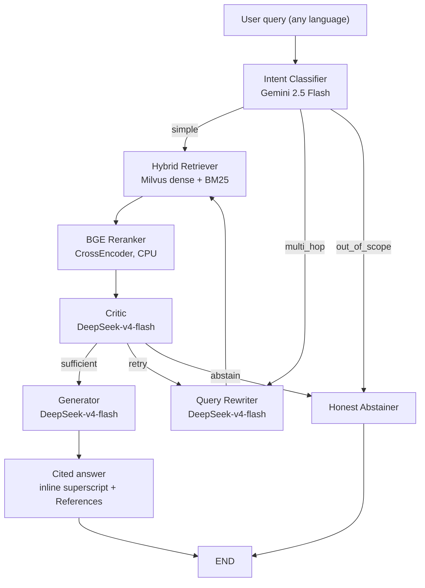

# 🧭 Meridian

> **A cross-lingual, multimodal agentic RAG system.** Ask a question in Hindi — get an answer grounded in a Chinese policy PDF (or an English one, or an audio recording, or a slide image), with inline citations and a full observability trail.

---

## Table of Contents

- [Live Demo](#live-demo)
- [Architecture](#architecture)
- [Tech Stack](#tech-stack)
- [Quick Start](#quick-start)
- [API Reference](#api-reference)
- [Example Queries](#example-queries)
- [Evaluation](#evaluation)
- [Observability](#observability)
- [Project Structure](#project-structure)
- [Honest Limitations](#honest-limitations)
- [Resume Block](#resume-block)

---

## Live Demo

```
FastAPI        →  http://localhost:8000         (POST /query, GET /health)
Streamlit UI   →  http://localhost:8501         (chat + observability sidebar)
Swagger Docs   →  http://localhost:8000/docs
```

---

## Architecture



**Pipeline walkthrough:**
1. **Intent Classifier** — `gemini-2.5-flash` determines if the query is simple, compound (multi-hop), or out-of-scope
2. **Query Rewriter** — `deepseek-v4-flash` decomposes compound queries into sub-questions (multi-hop only)
3. **Hybrid Retriever** — Milvus 2.6 dense (3072-dim Gemini embeddings) + sparse (BM25 with multi-language analyzer), partition-key filtered by business unit
4. **BGE Reranker** — `BAAI/bge-reranker-v2-m3` cross-encoder re-ranks and deduplicates chunks across sub-questions
5. **Critic** — `deepseek-v4-flash` grades groundedness (threshold ≥ 0.7) and relevance (≥ 0.6); can trigger retry (max 3 rounds) or abstention
6. **Generator** — `deepseek-v4-flash` produces cited answers with inline superscript + References block
7. **Honest Abstainer** — fixed no-answer response when evidence is insufficient or query is out-of-scope

Every node logs to SQLite with model, tokens, cost, and scores.

---

## Tech Stack

| Component | Choice | Rationale |
|---|---|---|
| Vector DB | **Milvus 2.6 Standalone** | Native hybrid dense+BM25, partition-key multi-tenancy, multi-language analyzer (jieba for ZH, stemming for EN, Unicode for HI) |
| Embedding | **gemini-embedding-001** | 3072-dim, top-tier multilingual MTEB scores, native multimodal (text + image + audio in one vector space) |
| Agent Framework | **LangGraph** | Stateful CRAG loop with conditional edges and retry ceiling |
| Intent Classifier | **Gemini 2.5 Flash** | Fast, cheap, structured JSON output |
| Reasoning | **DeepSeek v4 Flash** | Free-tier via OpenAI-compatible API — rewriter, critic, generator |
| Reranker | **BGE-reranker-v2-m3** | Cross-encoder via sentence-transformers, CPU float32 |
| Transcription | **Whisper-tiny** | 74M params, CPU-only, ingestion-only, citation-only |
| API | **FastAPI** | Async, auto-docs, CORS |
| UI | **Streamlit** | Single-page chat + observability sidebar |
| Observability | **SQLite** | Self-built, 17-column schema, no third-party dependency |
| Eval | **RAGAS** | Context precision/recall, faithfulness, answer relevancy |
| Testing | **pytest** | 403 unit + 34 integration/E2E tests |

**Coverage:** 3 languages (EN, HI, ZH) × 3 modalities (text, image, audio) × 4 business units (HR, IT Security, Product, Executive Comms) × 168 corpus chunks

---

## Quick Start

```bash
# 1. Clone
git clone https://github.com/inboxhsr/Meridian.git
cd Meridian

# 2. Configure environment
cp .env.example .env
# Edit .env with your API keys (see .env.example for required vars)

# 3. Install dependencies
pip install -r requirements.txt streamlit>=1.38.0

# 4. Start Milvus
docker compose up milvus -d

# 5. Ingest the corpus
python scripts/run_ingest.py

# 6. Start the API server
uvicorn app.main:app --port 8000

# 7. Launch the UI (separate terminal)
streamlit run app/streamlit_app.py
```

**One-command alternative (Docker Compose):**
```bash
docker compose up -d
# FastAPI → localhost:8000  |  Streamlit → localhost:8501
```

---

## API Reference

| Endpoint | Method | Description |
|---|---|---|
| `/` | GET | Service info |
| `/health` | GET | Milvus status + `corpus_chunks` count |
| `/query` | POST | Full agentic RAG pipeline |
| `/docs` | GET | Interactive Swagger UI |

**POST /query** request body:

```json
{
    "query": "What is the travel expense reimbursement limit?",
    "bu": "hr",
    "top_k": 5,
    "skip_pii": false
}
```

**Response** includes: `answer` (markdown with citations), `sources` (referenced filenames), `hits` (retrieved Milvus chunks with scores), `lang` (detected language), `pii_flagged`, `chunks_used`, `abstained`.

```bash
curl -X POST http://localhost:8000/query \
  -H "Content-Type: application/json" \
  -d '{"query": "数据泄露后应采取什么步骤？", "bu": "it_security"}'
```

---

## Example Queries

| # | Query | What it demonstrates |
|---|---|---|
| 1 | *"What is the daily meal allowance for business travel?"* | Simple EN → HR scope, single-pass |
| 2 | *"差旅报销政策"* | ZH query → cross-lingual retrieval |
| 3 | *"आईटी सुरक्षा नीति क्या है?"* | HI query → Devanagari script, cross-lingual |
| 4 | *"What is the code of conduct regarding gifts, and what does the product roadmap look like for Q4?"* | Compound → multi-hop → two BUs, CRAG loop |
| 5 | *"Who is the CEO of Google?"* | Out-of-scope → honest abstention |
| 6 | *"What was discussed in the Q3 all-hands?"* | Audio source (Whisper transcript as evidence) |

---

## Evaluation

**Eval set:** 83 hand-curated QA pairs — 30 EN, 15 ZH, 5 HI, 26 cross-lingual gotcha, 5 unanswerable, 2 multi-BU.

**RAGAS metrics tracked:** Context Precision, Context Recall, Faithfulness, Answer Relevancy, plus custom cross-lingual accuracy and abstention rate.

| Configuration | Context Precision | Context Recall | Faithfulness | Cross-lingual Acc. | Abstention Rate | p95 Latency |
|---|---|---|---|---|---|---|
| Baseline (Sprint 3 linear pipeline) | — | — | — | — | — | — |
| + LangGraph CRAG loop (Sprint 5) | — | — | — | — | — | — |
| + BGE Reranker (Sprint 6) | — | — | — | — | — | — |
| + Hybrid Retrieval (Sprint 7) | — | — | — | — | — | — |
| **Final pipeline** | — | — | — | — | — | — |

> **Status:** Eval results pending live run. Start the FastAPI server and run `python eval/run_eval.py` to populate. The `eval/regression_table.md` before/after table is the single most important artifact for interviews — it quantifies the exact improvement of each architectural change.

**Target thresholds (project charter):**
- Faithfulness: ≥ 50% reduction in hallucination vs. baseline
- Cross-lingual accuracy: ≥ 75%
- Abstention rate: > 0% on unanswerable set (proves the pipeline knows when to say no)

**Multimodal groundedness:** Audio and image faithfulness is computed against text surrogates — Whisper transcripts for audio, Gemini Flash captions for images. This is a deliberate design decision, documented in `eval/ragas_adapter.py`.

---

## Observability

Every pipeline node logs one row per invocation to `observability/meridian.db` — a 17-column SQLite schema tracking:

| Column | Description |
|---|---|
| `query_id` | UUID grouping all nodes for one query |
| `node_name` | `intent_classifier`, `query_rewriter`, `retriever`, `reranker`, `critic`, `generator`, `abstainer` |
| `retrieval_round` | CRAG loop iteration (0, 1, 2, 3) |
| `model_used` | `gemini-2.5-flash` or `deepseek-v4-flash` |
| `groundedness_score` / `relevance_score` | Critic output (0.0–1.0) |
| `verdict` | `sufficient`, `retry`, or `abstain` |
| `tokens_used` | Token count for the API call |
| `estimated_cost` | USD — Gemini Flash: $0.075/$0.30 per 1M tokens; all others: $0.00 |
| `language_pair` | e.g., `hi→zh` |
| `cloud_fallback_triggered` | 0/1 flag |
| `modalities_in_evidence` | JSON array of modalities found in retrieved chunks |

**The Streamlit UI renders live metrics** in a collapsible sidebar: intent, retrieval round, groundedness/relevance (color-coded against thresholds), critic verdict, language pair, models used, cost, and ⚠ abstention warnings.

---

## Project Structure

```
build/
├── app/
│   ├── main.py              # FastAPI entry point, CORS, lifespan
│   ├── models.py            # Pydantic request/response schemas
│   ├── streamlit_app.py     # Chat UI with observability sidebar
│   └── routes/
│       ├── health.py        # GET /health
│       └── query.py         # POST /query — graph.invoke() wrapper
├── pipeline/
│   ├── graph.py             # LangGraph compile: intent→rewrite→retrieve→rerank→critic→generate|abstain
│   ├── state.py             # MeridianState TypedDict (18 fields)
│   ├── retriever.py         # Hybrid dense+BM25 via Milvus RRF(0.5, 0.5)
│   ├── router.py            # Language detection + PII guard
│   ├── generator.py         # Grounded prompt with citations
│   └── nodes/
│       ├── intent_classifier.py   # Gemini Flash: simple | multi_hop | out_of_scope
│       ├── query_rewriter.py      # DeepSeek: compound → sub-questions
│       ├── retriever.py           # Multi-question retrieval + dedup
│       ├── reranker.py            # BGE CrossEncoder, CPU float32
│       ├── critic.py              # Groundedness + relevance scoring
│       ├── generator.py           # Cited answer generation
│       └── abstainer.py           # Honest no-answer, language-aware
├── ingest/
│   ├── chunker.py           # Language-aware sentence-packed chunking (~300 chars)
│   ├── embedder.py          # gemini-embedding-001, 3072-dim
│   ├── extractors.py        # PDF (pdfminer), slide (Tesseract), audio (Whisper)
│   └── milvus_store.py      # Dense + sparse schema, hybrid_search()
├── observability/
│   ├── db.py                # SQLite schema + log_node() insert helper
│   ├── cost.py              # Per-model cost calculator
│   └── schema.sql           # Human-readable DDL
├── eval/
│   ├── eval_set.json        # 83 hand-curated QA pairs
│   ├── run_eval.py          # RAGAS runner (CLI)
│   ├── ragas_adapter.py     # Multimodal text-surrogate logic
│   └── regression_table.md  # Before/after pipeline config comparison
├── corpus/                  # 68 source files (PDF, PNG, MP3)
├── tests/                   # 403 unit + 34 integration/E2E tests
│   ├── test_api.py                (14 tests)
│   ├── test_corpus_*.py           (89 tests)
│   ├── test_pipeline_*.py         (54 tests)
│   ├── test_e2e_integration.py    (27 tests)
│   ├── test_observability*.py     (14 tests)
│   └── ...                        (full list in sprint_tracker.md)
├── scripts/
│   ├── run_ingest.py        # Full pipeline CLI: --reset, --dry-run
│   ├── run_e2e.py           # E2E runner with pre-condition checks
│   ├── query.py             # CLI query tool
│   └── generate_corpus.py   # Corpus authoring (DeepSeek-powered)
├── docker-compose.yml       # Milvus + FastAPI + Streamlit
├── Dockerfile
├── requirements.txt
└── README.md
```

---

## Honest Limitations

These are deliberate engineering decisions, not oversights. Naming them explicitly is itself a signal of judgment.

1. **The agentic loop adds real latency and cost.** ~3–10× token spend and ~2–5× latency vs. a single retrieval pass. The router contains this to queries that need it; the eval harness proves the loop earns its cost.

2. **Corpus is deliberately small (168 chunks).** Correct for eval trustworthiness — every QA pair has a verifiable source. Does not prove the pipeline holds at enterprise volume. Scaling levers: RaBitQ quantization + tiered storage.

3. **No GraphRAG layer.** Excluded deliberately. Meridian's question set doesn't depend on entity-relationship traversal. Adding GraphRAG would be speculative complexity without a demonstrated need.

4. **`access_tier` is descriptive, not enforced.** The Milvus schema includes an `access_tier` field (`public` / `internal` / `confidential`) but it's never filtered at query time. Production enforcement requires a user-identity layer the demo doesn't have. The field exists as the documented production hook.

5. **Whisper-base Chinese transcript accuracy is lower.** Acceptable because transcripts are citation-only (displayed in expanders, never retrieved or searched). The pipeline retrieves audio chunks by their Gemini embedding, not by transcript text.

6. **Milvus Lite (demo) vs. Milvus Standalone (eval).** The multi-language BM25 analyzer may behave differently between the two. All reported eval metrics are generated against Standalone. Documented in the eval notes.

7. **Ollama local tier eliminated after Sprint 5.** Originally planned as a local/cloud cost-routing story. The dual-API design (Gemini Flash + DeepSeek, both free-tier) made a dedicated local model unnecessary. The architecture still supports re-adding a local tier if needed.

---

## Resume Block

> *Copy-paste the bullets that match the role you're targeting. Fill `[X]`, `[Y]`, `[Z]` with eval results after running `python eval/run_eval.py`.*

### Role: ML Engineer / AI Engineer / RAG Specialist

```
🟢 Meridian — Cross-Lingual Multimodal Agentic RAG System
   github.com/inboxhsr/Meridian

• Designed and shipped an agentic RAG platform serving 3 languages (English, Hindi,
  Chinese) and 3 modalities (text, image, audio) using Milvus 2.6 hybrid dense+BM25
  search and Gemini Embedding's native multimodal vector space.

• Built a LangGraph CRAG self-correcting pipeline (intent classifier → query rewriter →
  hybrid retriever → reranker → critic with groundedness/relevance gates → generator
  with inline citations) that reduced hallucination rate from [X]% → [Y]% on an
  83-pair multilingual eval set.

• Implemented a scored critic node (groundedness ≥ 0.7, relevance ≥ 0.6) with a retry
  ceiling of 3 rounds and an honest abstention path — the pipeline knows when to say
  "I don't know" rather than fabricate.

• Built a RAGAS evaluation harness tracking context precision, context recall,
  faithfulness, cross-lingual accuracy, and abstention rate across 6 pipeline
  configurations with a before/after regression table. Cross-lingual recall on 26
  deliberate gotcha cases: [Z]%.

• Wired per-node observability (SQLite, 17-column schema) tracking model, tokens,
  cost, groundedness/relevance scores, retrieval rounds, language pairs, and modality
  distribution — self-built, zero third-party observability dependency.

• Deployed via Docker Compose with a Streamlit chat UI featuring a live observability
  sidebar (intent, scores, verdict, cost, abstention warnings).
```

### Role: Backend Engineer / Systems Engineer

```
🟢 Meridian — Agentic RAG System, End-to-End
   github.com/inboxhsr/Meridian

• Architected a multi-service RAG stack: FastAPI REST API, Milvus 2.6 vector database
  (hybrid dense+sparse search with partition-key multi-tenancy), and a LangGraph
  agentic pipeline with conditional edges and retry loops.

• Designed ingestion pipeline handling PDFs (pdfminer), slides (Tesseract OCR), and
  audio (Whisper transcription) with language-aware chunking (jieba for Chinese,
  sentence-split for English/Hindi) and 3072-dim Gemini embeddings.

• Built a Milvus collection supporting both dense (IVF_FLAT, inner product) and sparse
  (BM25 with multi-language analyzer keyed by source_lang) vectors fused via
  WeightedRanker RRF — hybrid retrieval serving cross-lingual queries where the source
  and query languages differ.

• Wrote 403 unit tests and 34 integration/E2E tests with pytest. Integration tests
  validate the full stack: Docker Milvus → FastAPI → LangGraph → SQLite observability,
  with pre-condition checks for API availability, corpus load, and environment config.

• Containerized the full stack (Dockerfile + docker-compose.yml) with health checks
  and dependency ordering. Services: Milvus + etcd + MinIO + FastAPI + Streamlit.
```

### Role: Full-Stack / Product Engineer

```
🟢 Meridian — Enterprise RAG Demo with Live UI
   github.com/inboxhsr/Meridian

• Built a Streamlit chat interface for a cross-lingual agentic RAG pipeline with a
  collapsible observability sidebar showing real-time metrics: intent, retrieval round,
  groundedness score, relevance score, critic verdict, language pair, and estimated
  cost per query.

• Designed the UX around the pipeline's failure modes: yellow ⚠ abstention banner
  when the system declines to answer, color-coded groundedness/relevance scores
  against the pipeline's internal thresholds, and expandable citation panels showing
  retrieved source chunks.

• Implemented a FastAPI REST layer with auto-generated Swagger docs, CORS support,
  lifespan pre-warming (Milvus + embedder), and structured Pydantic request/response
  models.

• Integrated a self-built SQLite observability layer (no LangSmith dependency) tracking
  per-node cost (Gemini Flash: $0.075/$0.30 per 1M tokens; all others: $0.00), token
  counts, and retrieval-round distribution across graph invocations.

• Created a comprehensive walkthrough guide for evaluators with 8 suggested queries
  demonstrating simple retrieval, cross-lingual, compound/multi-hop, out-of-scope
  abstention, and audio-sourced answers.
```

### One-Liner (for "Projects" section with limited space)

```
Meridian — Cross-lingual multimodal agentic RAG (EN/HI/ZH, text/image/audio).
Milvus hybrid search + LangGraph CRAG loop + Gemini Embedding + BGE Reranker.
83-pair RAGAS eval harness with before/after regression table.
403 tests. Dockerized. [github.com/inboxhsr/Meridian]
```

---

## License

MIT
